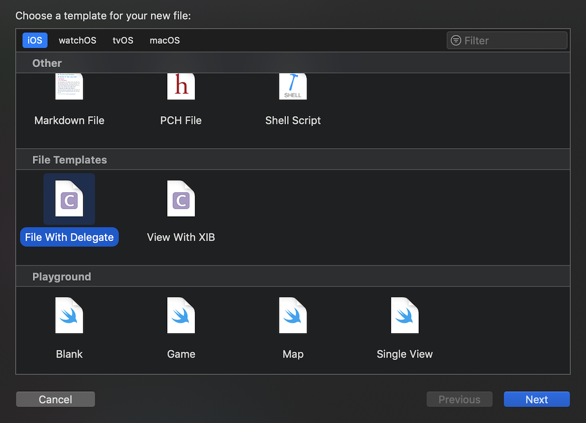

# Xcode Templates

By installing these template you can create file with useful boilerplates

## Install/Uninstall

Clone or download the repo, and run bellow commands inside cloned/donwloaded folder where you can find **Makefile**

🛠 To install templates, run:

> make install


🗑 To uninstall templates, run:

> make uninstall

## Using Templates

The added templates can be found when you add new file



## How Create and Add Your New Template

Installed template can be found at: `~/Library/Developer/Xcode/Templates/File\ Template`.
Copy with different name one of the template as starting point, then modify it as you preferred.

## How To Contribute To This Repository

Your finished template can be added to root folder of this repository, then modify the **Makefile** as below so your template will be listed when **make install**/**make uninstall** executed

```
TEMPLATES=	View\ With\ XIB.xctemplate \
		File\ With\ Delegate.xctemplate \
		Your\ New\ Template.xctemplate

```

## License

Usage of the templates is available under the MIT license. See the LICENSE file for more info.


